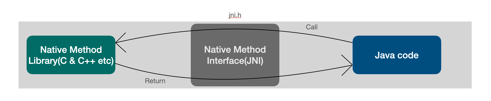

#  자바 네이티브 메서드 인터페이스(JNI) 기본


## JNI란?

자바 네이티브 메서드 인터페이스로 자바 프로그램에서 네이티브 메서드를 호출 할 수있도록 해주는 기술이다. 



즉, 자바 코드에서 C, C++등으로 만들어진 기능들을 실행 하는 것이다.

JNI를 사용해서 java에서 네이티브 메서드를 사용해보자.

간단하게 c에서 hello world!를 프린트 함수를 실행시키는 함수를 자바에서 호출 해보자.

## 자바 코드 작성

```java
//HelloWorld.java
class HelloWorld
{
        private native void print(); // c에서 print함수를 가져온다
        public static void main(String[] args)
        {
                new HelloWorld().print();
        }
        static{
                System.loadLibrary("HelloWorld"); 
        }
}
```

static 블럭을 보면 라이브러리 HelloWorld 라이브러리를 로드하고있다.  이것이 C로 구현된 라이브러리이고 실제 구현된 C 라이브러리를 통해 실행된다. `native` 라는 키워드로 되어있는 함수가 네이티브 메서드라는 것을 명시해준다.


## 자바 코드 컴파일

```bash
javac HelloWorld.java
```

다음과 같이 자바코드를 컴파일하여 `HelloWorld.class` 파일을 생성 해준다.


## C/C++ 헤더 파일 생성

JVM의 경우 자바 클래스 내부에 선언된 네이티브 메서드와 매핑할 C 함수를 로드된 라이브러리에서 찾아 맵핑테이블을 만들어 놓는다. 

JVM은 맨 처음 그림에서 보듯이 JNI 명세를 통해서 구현된 C 함수와 맵핑한다. 

JNI의 명세에 맞도록 헤더 파일을 만들어주는 툴이라는 `javah`가 존재한다. 하지만 jdk 9이후 버전 부터는 deprecated되었고 기존의 `javac` 로 통합되었다. 두가지 방법을 다 소개하겠다.

```bash
# openjdk 8이하
# HelloWorld.class 파일을 받는다.
javah HelloWorld 
```

```bash
# openjdk 9이상
# java 파일을 받아 컴파일과 헤더 생성을 동시에 해준다.
javac -h <target_directory> HelloWorld.java
```

위와 같이 하게 되면 HelloWorld.h 다음과 같은 헤더파일이 생성된다.

```c
/* DO NOT EDIT THIS FILE - it is machine generated */
#include <jni.h>
/* Header for class HelloWorld */

#ifndef _Included_HelloWorld
#define _Included_HelloWorld
#ifdef __cplusplus
extern "C" {
#endif
/*
 * Class:     HelloWorld
 * Method:    print
 * Signature: ()V
 */
JNIEXPORT void JNICALL Java_HelloWorld_print
  (JNIEnv *, jobject);

#ifdef __cplusplus
}
#endif
#endif
```

위와 같이 class파일에 존재하는 자바 네이티브 함수에 맞는 헤더 파일을 생성하여 JNI를 통해 연결할 수 있는 C 함수가 정의 되어있다. 따라서 위의 이름을 보게 되면 

```C
JNIEXPORT void JNICALL Java_HelloWorld_print(JNIEnv *, jobject);
반환 타입         접두사.      클래스이름 네이티브메서드이름 공통 매개변수
```

위의 JNI 명세에 맞게 생성된 함수를 보면 자바에 어떤 클래스 네이티브메서드를 호출하는지 파악할 수 있다.

기본적으로 헤더파일에 함수에는 2개의 파라미터가 포함되어있고 반드시 포함되어야한다.

첫번째 `JNIEnv *`는 JNI 인터페이스의 포인터로 JNI 명세에 포함된 다양한 JNI 함수를 호출 할 수 있다.(JNI 함수는 JNI 네이티브 함수가 아니라 JNI 네이티브 함수에서 자바의 객체를 생성한다던가 메서드를 호출하는 것과 같이 JNI에서 기본적으로 제공하는 함수들의 모음이다. 위의 헤더파일에 보이는 `jni.h` 에서 확인 할 수 있다)

두번째 `jobject`는 JNI에서 제공되는 자바 네이티브 타입, C 코드에서 자바 객체에 접근할 때 쓰인다. 이것은 네이티브 메서드를 호출한 객체의 레퍼런스 값이 전달 된다.(여기에서는 new HelloWorld() 객체의 레퍼런스) 이것도 마찬가지로 `jni.h`, `jni_md.h` 를 참조하면 자세한 내용을 확인할 수 있다.

세번째부터는 네이티브 메서드가 전달하는 파라미터가 전달되는데(위 함수는 전달하는 파라미터가 없으므로 존재 X), c++/java의 타입이 아닌 따로 자바 네이티브 타입을 통해 전달되며 예를들어 string 이면 jstring 으로 명명되어있고 `jni.h` 와 `jni_md.h` 에 타입이 정의되어 있다.


## C 코드 구현

이제 헤더파일에 대한 구현이 필요하다. 위의 헤더 파일에 맞는 C 코드를 작성해보자

```c
// libHelloWorld.c
#include <stdio.h>
#include "HelloWorld.h"

JNIEXPORT void JNICALL
  Java_HelloWorld_print(JNIEnv *env, jobject obj)
{
  printf("Hello World!\n");
  return;
}
```

이제 이것을 컴파일하여 동적 라이브러리를 통해서 공유 라이브러리로 만들어 주어야 한다.

OS에 따라서 동적 라이브러리를 부르는 명칭이 다른데, 맥의 경우는 `*.dylib`, 윈도우는 `*.dll`, 리눅스의 경우 `*.so` 이다

```bash
# MacOS
# JAVA_HOME으로 위치를 설정해주어야한다.
export LD_LIBRARY_PATH=$LD_LIBRARY_PATH:.  #참조하는 동적 라이브러리 패스를 지정
gcc -I${JAVA_HOME}/include -I${JAVA_HOME}/include/darwin -shared libHelloWorld.c -o libHelloWorld.dylib
```


## 자바 바이트코드 실행

```bash
java HelloWorld
# Hello World! 가 출력된다
```

