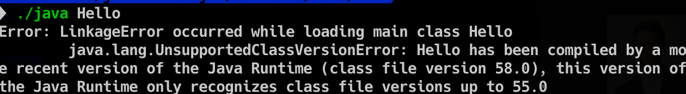
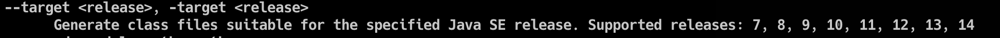
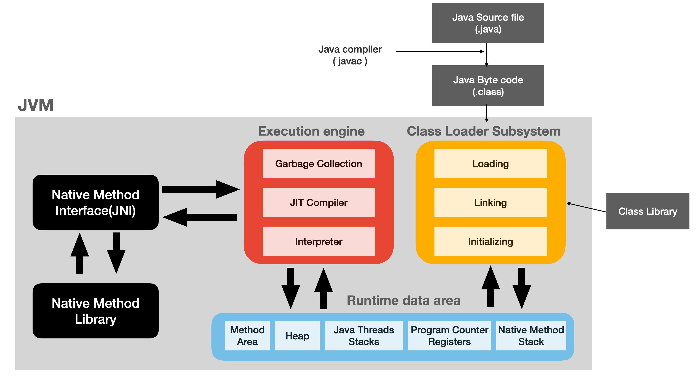

# JVM이란? 자바 코드는 어떤 방식으로 실행 될까?


## JVM이란?

JVM은 Java Virtual Machine으로 자바 가상 머신의 약어로 자바 바이트코드를 실행하는 주체이다. 여기서 가상 머신이라는 것은 소프트웨어적으로 인터프리터나 JIT 컴파일 방식을 통해서 실제 물리 컴퓨터 위에서 바이트코드를 실행하도록 물리적 기계처럼 구현된 것이다. JVM의 특징으로는 다른 물리적 기계는 레지스터 방식으로 동작하여 기계어를 작동시키는지만, JVM 같은 경우는 **스택** 기반으로 바이트코드를 실행시키는 가상머신이며, **GC(가비지컬렉션)**를 통하여 메모리 관리를 진행한다. 또한 JVM은 자바라는 언어의 가장 큰 특징이 되는 WORA(write once, run anywher)를 가능하도록 **어떤 플랫폼에서도 구애 받지 않고** 자바 바이트코드를 실행할 수 있도록 한다. 즉 이론적으로 어떤 CPU나 운영체제 종류에 무관하게 동일한 동작을 할 것을 보장해준다.

## JVM vs JRE vs JDK

### JRE(Java Runtime Enviroment)

자바 어플리케이션을 실행하기 위한 최소 배포 단위로 **JVM + 필요 라이브러리**를 포함한다. 실행을 목적으로 하기 때문에 개발 관련 도구는 포함하지 않음.오라클에서는 자바 11 이후 버전 부터는 JDK만을 제공하며 JRE만 따로 제공하지 않는다.  

### JDK(Java Development Kit)

**JRE + 개발에 필요한 툴**이 포함된다. 개발에 필요한 컴파일러(javac), 디버거, javadoc, apt, javap 등을 포함한다. 하지만 오라클에서는 JRE를 따로 제공하지 않고 이제 JDK 만을 제공한다. 


## 자바 소스 코드가 실행되는 과정

1. Java 소스 코드 (.java)를 컴파일러(javac)를 통해 자바 바이트코드(.class)로 컴파일 한다. 

2. JVM이 실행 되어 OS로 부터 메모리를 할당 받는다.

3. 클래스 로더를 통하여 바이트코드가 JVM으로 로딩 된다.

4. 로딩된 바이트코드를 실행 엔진이 해석한다.(인터프리트, JIT 컴파일)

5. 해석되는 바이트코드들은 런타임 데이터 영역에 배치되어 코드가 실행된다. 

   실행 과정(런타임)중 JVM이 필요에 따라 GC와 쓰레드 관리를 한다.


## 자바 Cross-compile

 만약 jdk 높은 버전(14)으로 컴파일 한 것(.class)을 jdk 낮은 버전(11)로 실행시키면 어떻게 될까?, 반대로 jdk 11 버전으로 컴파일 한 것을 jdk 14로 실행시킨다면 어떻게 될까?

전자의 경우는 아래와 같은 오류가 발생한다.



높은 버전에서 컴파일 된 것을 낮은 버전의 JVM에서 실행하려한다 하는 에러이다.

후자의 경우는 정상적으로 작동하게 된다.

그렇다면 해결하기 위해서는 javac를 사용할 때 크로스 **컴파일 옵션**을 이용하여 특정 버전으로 컴파일 시켜줄수가 있다.



```bash
javac -target <release>  
```

## JVM의 구성 요소




### 클래스 로더(Class Loader)

클래스 로더는 자바의 클래스를 JVM으로 동적 로드 해준다. 이 말은 코드를 실행하며 새로운 자바 클래스를 호출하면 클래스 로더에 의해서 동적으로 메모리에 위치 시킨다는 것이다. 작성한 코드가 아닌 라이브러리에 의한 코드도 로딩하여 런타임 메모리 영역에 위치 시킨다. 구체적으로는 Loading, Linking, Initializing의 과정을 통해 클래스 로더가 작동하지만, 여기에서는 넘어가도록 하겠다. 

### 실행 엔진(Execution engine)

#### 인터프리터(Interpreter) 

기본적으로 자바의 바이트 코드는 파이썬와 같이 인터프리터를 통해서 자바 바이트 코드 한줄씩 해석을 하여 실행한다. 이 실행 방식은 **한줄씩 번역하여 실행**하기 때문에 컴파일 방식에 비해서 전체적으로 프로그램의 실행 속도가 느려지게 된다. 따라서 이런 속도의 단점을 보완하기 위해 JIT 컴파일러로 보완하고 있다.

#### JIT 컴파일러 (Just-In-Time Compiler)

자바 바이트 코드는 인터프리터의 단점을 보완하기 위해서 JIT 컴파일러를 도입하였는데, 전통적으로 컴퓨터 프로그램을 만드는 방식은 인터프리트 방식과 , 정적 컴파일 방식이라고 생각할 수 있다. 인터프리터의 경우는 위에서 설명하였고, 정적 컴파일은 실행하기 전에 프로그램 코드를 기계어로 번역한다. JIT는 이 2가지 방식을 혼합하여 적용한 방식이다. 즉, 인터프리터로 기계어 코드(바이너리 코드)를 생성하면서 중간 중간 코드를 캐싱하여 , 같은 함수가 불리면 매번 새로운 기계어 코드를 생성하지 않도록 해주는 것이다. 여기에 캐싱하는 것에 여러 전략을 추가하여 자주 사용되는 것들을 주로 캐싱하여 시간을 절약한다.

잠깐!  **바이트코드 vs 바이너리 코드(기계어)**

이름이 비슷하여 헷갈릴 수 있지만 바이트코드는 특정 하드웨어가 아닌 JVM과 같은 가상 머신에서 돌아 갈 수 있도록 표현된 이진 표현법이다. 바이너리 코드(기계어)는 특정 기계(각 cpu 아키텍쳐)가 이해할 수 있는 이진 표기법이다.  바이트코드는 가상 머신에 의해서 바이너리 코드로 변환되어 실행되게 된다. 또 정적 컴파일 방식에서는 컴파일러-> 어셈블러를 통해 바이너리 코드(기계어)로 변환된다. 

#### GC(Garbage Collection)

자바에서 동적으로 heap 영역에 객체(메모리)가 할당되는데 GC는 사용하지 않는 오브젝트를 자동으로 파악하여 heap 영역에서 제거하는 역할을 한다. 


## 런타임 메모리 영역(Runtime Memory area)

### 메서드 영역(Method area)

클래스에 정보를 처음 메모리에 올릴 때 초기화되는 영역이다. 즉 클래스 로더가 읽은 바이트 코드를 저장하는 영역이다. 대부분의 바이트코드는 메소드 바이트 코드이기 때문에 대부분의 코드가 메서드 영역에 올라간다. 메서드 영역 내부에는 런타임 상수 풀(Runtime Constant Area)가 존재하여 상수 자료형을 저장하여 사용할 수 있게 하고 중복을 방지한다.

**필드 정보**로 멤버변수의 이름, 데이터 타입, 접근 제어자 정보(public, private)의 정보를 저장한다.

**메서드**에서 메서드의 이름, 리턴타입, 매개변수, 접근 제어자 정보를 저장한다.

**타입관련 정보**로 class or interface의 여부와, 속성, 이름, super class의 전체 이름을 저장한다.

###  힙(Heap)

객체를 실제로 저장하는 저장 공간이다. **new를 통해 생성된 객체와 배열**은 모두 heap에 저장되며 Class 영역에 올라온 클래스만 객체로 생성이 가능하다. 힙은 여러 부분으로 나누어져 저장된다. 

### 자바 쓰레드 스택(Java threads Stack)

각각의 쓰레드 별로 흐름을 가지고 있고 메서드를 호출하게 되면 여러 데이터들을 할당하여 저장하고 사용해야 한다. 이것을 위해 사용되는 영역이다. 변수 데이터, 임시 데이터 쓰레드, 메서드의 정보를 가지고 있다. 메서드 호출시마다 스택 프레임이 생성이 되고 메서드가 삭제 되면 프레임별로 삭제가 이루어진다. 메서드 안에서 사용되는 지역 변수를 저장하고 메서드로 넘겨진 매개변수, 리턴 값 , 연산시 사용하는 임시 변수들을 저장하게 된다.

### 프로그램 카운터 레지스터(PC register)

쓰레드가 시작될 때 생성되며 각 쓰레드마다 각각의 PC를 생성한다. 각 쓰레드가 다음에 어떤 명령을 실행해야 하는지에 대한 정보를 기록하며 현재 실행 중인 명령의 주소를 갖고 있다.

### 네이티브 메서드 스택(Native Method Stack)

자바가 아닌 다른 언어로 작성된 코드 즉, 바이트 코드가 아닌 **실제 실행이 될 수 있는 기계어로 작성된 프로그램**을 실행하는 영역. 위의 그림에서 Java native interface를 통해 바이트 코드로 전환하여 저장한다. 일반적인 프로그램처럼 커널이 스택을 잡아 독자적으로 프로그램을 실행 할 수 있도록 한다.
