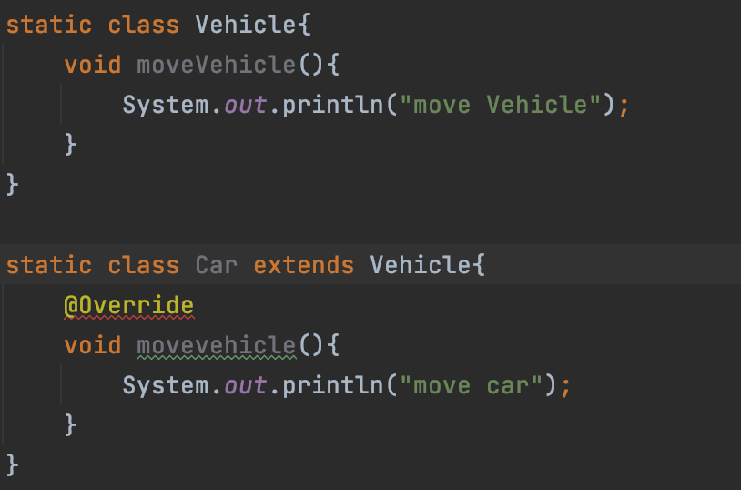
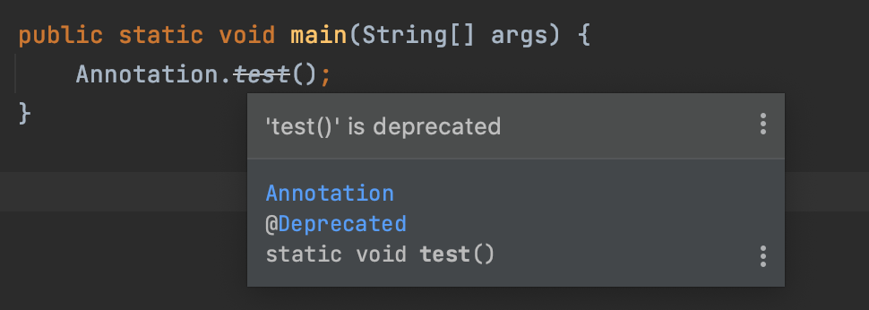
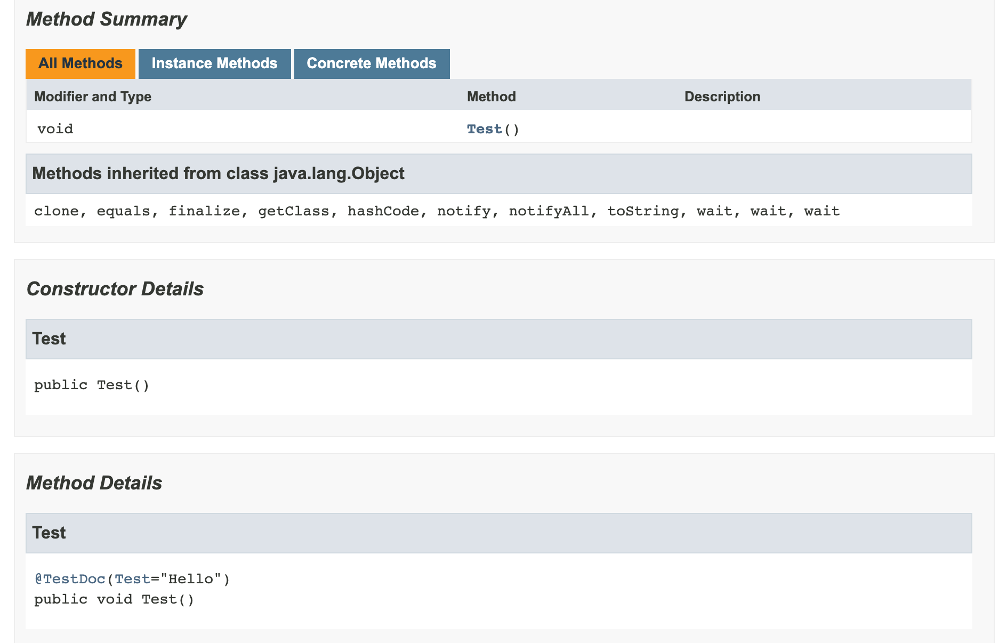

### 목표

자바의 애노테이션에 대해 학습하세요.


## 애너테이션이란?

주석이라는 의미를 가지고 있다. 일반적으로 사용되는 주석( // , /* */)과 역할과 다르지만 주석처럼 코드에 붙여 클래스에 의미를 부여하거나 기능을 주입할 수있다. 또한 해석되는 시점을 지정하여 사용할 수있다.

애너테이션 사용 예시

```java
@Test // 이 메서드가 테스트 대상임을 테스트 프로그램에게 알려준다.
public void method(){
  ...
}
```


애너테이션의 종류는 세가지로 분류할 수 있다.

- Built-in annotation: 
   - JDK에 내장 되어 있는 기본 애너테이션 ex) `@Override`
- Meta annotation: 
   - 애너테이션에 대한 정보를 나타내기 위한 애너테이션 ex) `@Documented`
- Custom Annotation: 
   - 개발자가 직접 애너테이션 타입을 만들어내서 사용하는 애너테이션


자바에서 제공하는 애너테이션들을 하나씩 살펴보자.

## Built-in annotation

### @Override

오버라이딩을 올바르게 했는지 컴파일러에게 체크하도록 명시한다. 

오버라이딩을 하는 경우 메서드 이름을 잘못 적어 오버라이딩이 아닌 새로운 메서드를 만드는 오류를 방지한다.

```java
class Vehicle {
  void moveVehicle() {...}
}
class Car extends Vehicle{
  void movevehicle() {...}// 오버라이딩을 의도 했지만 실수로 새로운 함수를 호출
}
```

따라서 자바에서는 오버라이딩시 @Override를 붙이는 것을 권장한다. 이름을 잘못 적는 실수를 아래와 같이 미리 방지할 수 있다.

 

### @Deprecated

앞으로 사용하지 않을 것을 권장하는 필드나 메서드에 붙여서 명시한다.

@Deprecated가 붙은 필드나 메서드를 사용하게 되면 다음과 같이 



IDE에서 경고를 하게 된다.

### @SuppressWarnings

컴파일러의 경고메시지가 나타나지 않도록 억제한다

괄호()안에 억제하고 싶은 경고의 종류를 문자열로 나타낸다.

```java
@SuppressWarnings("unchecked") // 제네릭과 관련된 경고를 억제

ArrayList list = new ArrayList(); // 제네릭 타입을 지정하지 않음
list.add(obj) // 여기서 발생하는 경고를 보여주지 않게 된다.
```

여러가지의 경고를 동시에 억제하고자 하는 경우 아래와 같이 사용

```java
@SuppressWarnings({"unchecked", "rawtypes"})  
```

### @SafeVarargs(JDK 1.7)

가변인자의 타입이 non-reifiable인 경우 발생하는 uncheck 경고를 억제

> Non-reifiable type: 런타임시 완전하게 오브젝트 정보를 표현할 수 없는 타입
>
> 제네릭 타입, 매개 변수화 타입등이 해당 된다.

생성자 또는 static 이나 final이 붙은 메서드에만 적용이 가능하다(오버라이딩이 가능하지 않아야 한다)

@SafeVarargs에 의한 경고의 억제를 위해 @SuppressWarnings를 사용하기도 한다.

### @FunctionalInterface(JDK 1.8)

함수형 인터페이스에 붙이면, 컴파일러가 올바르게 작성했는지 체크한다. 함수형 인터페이스에는 하나의 추상메서드만 가져야 한다는 제약이 있다. 추후 람다식을 배우면서 자세히 배울 예정

```java
@FunctionalInterface
public interface Runnable{
  public abstract void run(); // 추상메서드
}
```

### @Native(JDK 1.8)

네이티브 메서드에서 참조되는 상수라는 것을 알려주는데 사용된다.

## Meta annotation

메타 애너테이션은 '애너테이션을 위한 에너테이션'이다

애너테이션을 정의하는 경우, 적용 대상이나 유지기간의 지정에 사용

### @Target

애너테이션을 적용할 수 있는 대상의 지정에 사용된다.

```java
@Target({TYPE, FIELD, METHOD, PARAMETER, CONSTRUCTOR, LOCAL_VARIABLE})
@Retention(RetentionPolicy.SOURCE)
public @interface SuppressWarnings{
  String[] value();
}
```

|    대상 타입    |              의미              |
| :-------------: | :----------------------------: |
| ANNOTATION_TYPE |           애너테이션           |
|   CONSTRUCTOR   |             생성자             |
|      FIELD      |   필드(멤버변수, enum 상수)    |
| LOCAL_VARIABLE  |            지역변수            |
|     METHOD      |             메서드             |
|     PACKAGE     |             패키지             |
|    PARAMETER    |            매개변수            |
|      TYPE       | 타입(클래스, 인터페이스, enum) |
| TYPE_PARAMETER  |     타입 매개변수(JDK 1.8)     |
|    TYPE_USE     |    타입이 사용되는 모든 곳     |


### @Documented

특정 어노테이션을 javadoc으로 작성한 문서에 포함시키려면 @Documented 를 사용한다.

예를 들어 Spring에서 @Transactional 어노테이션의 경우 @Documented가 포함 되어있어 @Transactional 추가한 메서드는 javadoc에서도 @Transactional 어노테이션이 보이게 된다.

```java
@Documented
public @interface TestDoc {
    String Test();
}


public class Test {

    @TestDoc(Test = "Hello")
    public void Test(){
        System.out.println("test");
    }
}
```



### @Inherited

애너테이션을 자손 클래스에 상속하고자 할 때, @Inherited를 붙인다.

```java
@Inherited // @SupperAnno가 자손까지 영향 미치게
@Interface SupperAnno {}

@SuperAnno
Class Parent {}

Class Child extends Parent {} // 여기에도 애너테이션이 붙은 것으로 판단
```

### @Retention

애너테이션이 유지되는 기간을 지정하는데 사용된다.

| 유지 정책 |                       의미                       |
| :-------: | :----------------------------------------------: |
|  SOURCE   | 소스 파일에만 존재, 클래스파일에는 존재하지 않음 |
|   CLASS   |  클래스 파일에 존재. 실행시에 사용불가. 기본 값  |
|  RUNTIME  |      클래스 파일에 존재. 실행시에 사용가능       |

컴파일러에 의해 사용되는 애너테이션의 Retention은 SOURCE다.

```java
@Target(ElementType.METHOD)
@Retention(RetentionPolicy.SOURCE)
public @interface Override {}
```

실행시에 사용 가능한 애너테이션의 정책은 RUNTIME이다.

```java
@Documented
@Retention(RetentionPolicy.RUNTIME)
@Target(ElementType.TYPE)
public @interface FunctionalInterface {}
```

### @Repeatable

애너테이션을 여러 번 사용 할 수있도록 정의 가능하게 할 때 사용

```java
@Repeatable(RepeatableAnno.class) // ToDo 애너테이션을 여러번 사용 가능하게 한다
public @interface RepeatableAnno {
  String value();
}

@RepeatableAnno("check when deleted")
@RepeatableAnno("override inherited methods")
class My{
  ...
}

```


## 애너테이션 타입 정의

애너테이션을 직접 만들어 쓸 수 있다.

```java
@interface 애너테이션이름{
  타입 요소이름(); //애너테이션의 요소를 선언
  ...
}
```

애너테이션의 메서드는 추상 메서드이고, 애너테이션을 적용할 때 모두 지정되어야 한다.

```java
@interface TestAnno{
  int 			value();
  String		tested();
  String		testTools();
  TestType	testType(); // enum TestType {FIRST, FINAL}
  DateTime	testDate(); // 자신이 아닌 다른 애너테이션 @DataTime을 포함 가능
}
@interface DataTime{
  String		yymmdd();
  String		hhmmss();
}
```

- 애너테이션의 적용시 값을 지정하지 않으면 자동으로 사용되는 값을 default로 지정 가능
- 요소의 이름이 value인 경우 지정 생략 가능
- 요소의 타입이 배열인 경우, {}를 사용


```java
@interface TestAnno{
  int 			value() default 1;
  String[]	info() default {"aaa", "111"};
}

@TestAnno(5)
public class NewClass{
  ...
}

@TestAnno(info={"111","222"}) 
public class NewClass{
  ...
}
```

### Java.lang.annotation.Annotation

위 Annotation은 모든 애너테이션의 조상이다. 상속을 하지 못하는 데 그 이유는 인터페이스로 정의가 되어있기 때문이다. 따라서 모든 애너테이션은 Java.lang.annotation.Annotation을 상속받은 인터페이스이다.

### 애너테이션 요소의 규칙

- 요소의 타입은 Primitive, String, enum, 애너테이션, Class만 허용
- 괄호안의 매개 변수 선언 불가
- 예외 선언 불가
- 요소를 타입 매개변수로 정의 불가 


## 애너테이션 프로세서

- 소스코드 레벨에서 소스에 있는 애너테이션 정보를 읽어와서 컴파일러가 컴파일 단계에서 소스코드를 추가하거나 코드 변경 가능케함
- 바이트 코드 생성가능, 소스코드와 별개인 리소스도 생성가능

**대표적 예제**

- **Lombok(롬복)**
  - @Getter, @Setter, @Builder

- **AutoService**: `java.util.ServiceLoader`용 파일 생성 유틸리티
  - 리소스 파일을 만들어준다.
  - META-INF 밑의 service 밑에 ServiceLoader용 레지스트 파일을 만들어준다.

**장점**

컴파일 시점에 조작하기 때문에 런타임의 비용이 없다.

**단점**

기존의 코드를 고치는 방법으로 현재는 public한 api는 존재 X

 ### 참고
  자바의 정석 3rd edition, 남궁 성 저