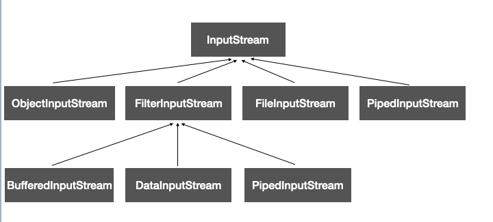
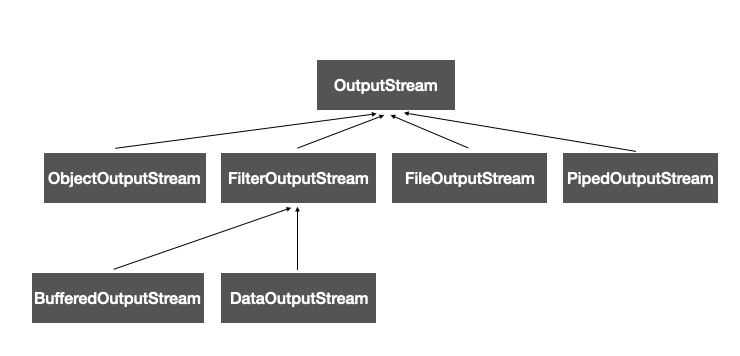
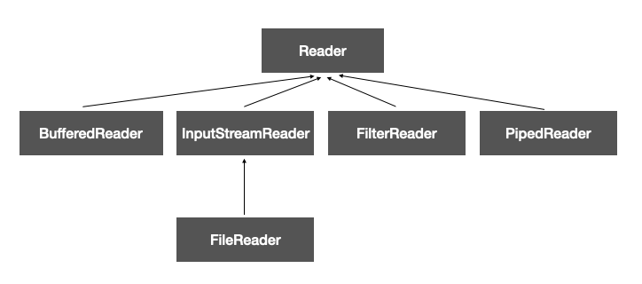
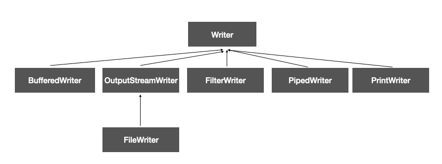

## 목표

- 자바의 Input과 Output에 대해 학습

### 

## 스트림(Stream) / 버퍼(Buffer) / 채널(Channel) 기반 I/O

### Input/Output

입출력(I/O)는 Input과 output으로 입력과 출력을 의미한다. 

컴퓨터에서 입출력이라는 것은 컴퓨터 내부와 외부 장치로 부터 데이터를 주고 받는 것을 의미한다.

- 키보드 / 파일로 부터 데이터를 받는다
- 화면 / 파일에 데이터를 저장한다.

### 스트림(Stream)

컴퓨터에서 데이터를 다른 쪽으로 전달하기 위해서 각 대상을 연결해주는 것이 필요하다. 이것으로 사용되는 것이 **스트림(Stream)**이다.

스트림이라는 영어의 단어의 뜻을 보자.

> Stream: 흐름, 시내, 연속, 계속, 끊임없는 움직임

즉, 데이터를 연속적으로 보내주는 연결 통로(파이프)와 같다고 생각할 수 있고, 그 특징으로 데이터를 한방향으로만 보내는 단방향 전송만 가능하다.

입력 스트림과 출력 스트림을 각각 가지고 입출력을 수행하게 되는 것이다.

**스트림의 특성(큐와 유사)**

- FIFO(First In First Out)
- 연속적으로 데이터를 받음
- 입출력시 다른 작업을 하지 못하는 Blocking 상태

### 자바 NIO(new I/O)

- JDK 1.4 이후 나온 기능으로 Non-Blocking으로 처리가 가능하며, 스트림이 아닌 채널(Channel)을 통한 양방향 통신이 가능

JDK 1.7 이후 자바 IO와 NIO 사이 일관성이 없는 클래스 설계를 잡고 비동기 채널 등의 네트워크 지원을 강화한 NIO.2도 추가됨

### IO와 NIO

| 구분                   | IO            | NIO     |
| ---------------------- | ------------- | ------- |
| 입출력 방식            | Stream        | Channel |
| 버퍼 방식              | Non-Buffer    | Buffer  |
| 비동기 방식            | 지원 안 함    | O       |
| 블로킹 / 넌블로킹 방식 | Only Blocking | Both    |


### 버퍼(보조 스트림)

스트림의 기능에 부족한 기능을 보완하기 위해 보조스트림을 이용한다.

보조 스트림은 직접적으로 데이터를 전달하고 받는 역할을 하기 보다 새로운 기능을 추가하거나 향상된 성능을 준다. 즉, 스트림을 생성하고 이를 이용해 보조스트림을 생성해서 사용하게 된다.

#### Buffer란?

데이터를 하나하나 보내기 보다는 한번에 보내기 위해 버퍼라는 일종에 중간에 데이터를 쌓아 놓는 저장소로 일정한 크기를 가지고 순서대로 저장된다.

**왜 버퍼를 이용할까?** 

 데이터를 보내는 것 또한 오버헤드(운영체제 API 호출, 시스템콜)가 존재한다. 즉, 일일히 하나씩 보내는 것보다 한번에 많이 보내는 것이 오버헤드를 최소화 할 수 있다.


### 채널(Channel)

스트림은 한방향씩 연결하는 단방향 통로였다면 채널은 하나의 통로에서 데이터를 주고 받는 것이 가능한 쌍방향 통로이며 기본적으로 버퍼를 이용해서 데이터를 주고받는다.(스트림의 경우는 보조 스트림을 사용해서 추가하는 방식)

소켓과 연결하는 `SocketChannel`

파일과 연결하는 `FileChannel`

파이프와 연결하는 `Pipe.SinkChannel`과 `Pipe.SourceChannel` 등이 존재하며 서버소켓과 연결된 `ServerSocketChannel`도 존재한다.

## InputStream & OutputStream

InputStream / OutputStream

- 바이트 기반의 입력 / 출력 스트림의 최상위 추상클래스
- 모든 바이트 기반의 입력 스트림은 이 클래스를 상속하여 만듬(최고 조상)
- 버퍼, 파일, 네트워크에서 데이터를 읽고 쓰는 작업을 수행

#### InputStream

| 메서드명                                 | 설명                                                         |
| ---------------------------------------- | ------------------------------------------------------------ |
| int available()                          | 스트림으로부터 읽어 올 수 있는 데이터의 크기를 반환          |
| void close()                             | 스트림을 닫아서 사용하고 있던 자원을 반납                    |
| void mark(int readlimit)                 | 현재위치를 표시, 추후 reset()에 의해서 표시해 놓은 위치로 다시 돌아갈 수 있음. readlimit은 되돌아갈 수 있는 byte의 수를 의미 |
| boolean markSupported()                  | mark()와 reset()을 지원하는지를 알려 준다. mark()와 reset() 기능을 지원하는 것은 선택이기 때문에 이것을 통해 확인 |
| **abstract int read()**                  | 1 byte를 읽어 온다(0~255 사이의 값), 더 이상 읽어 올 데이터 없으면 -1 반환. 자손들이 맞게 구현을 해야함 |
| **int read(byte[] b)**                   | b 배열 크기만큼을 읽어서 배열을 채우고 읽은 수를 반환        |
| **int read(byte[] b, int off, int Len)** | 최대 len개의 byte를 읽어서, 배열 b의 지정된 위치부터 저장. 실제로 읽어 올 수 있는 데이터가 len보다 적을 수 있음 |
| void reset()                             | 스트림에서의 위치 마지막으로 mark()이 호출되어있는 위치로 되돌린다 |
| long skip(long n)                        | 스트림에서 주어진 길이 n 만큼을 건너뛴다                     |

#### OutputStream

| 메서드명                               | 설명                                                         |
| -------------------------------------- | ------------------------------------------------------------ |
| void flush()                           | 스트림의 버퍼에 있는 모든 내용을 출력소스에 쓴다             |
| void close()                           | 입력 소스를 닫아서 사용하고 있던 자원을 반납                 |
| abstract void write(int b)             | 주어진 값을 출력소스에 쓴다                                  |
| void write(byte[] b)                   | 주어진 b 배열의 내용을 출력소스에 쓴다                       |
| void write(byte[] b, int off, int len) | 주어진 b 배열의 저장된 내용 중에서 off번째부터 len개 만큼을 출력소스에 적는다 |

## Byte와 Character Stream

#### Byte Stream

바이트 단위로 데이터를 입출력 하는 스트림, 데이터를 1바이트 단위로 처리한다.

일반적으로 영상, 이미지 등을 전송하는 경우 사용한다





#### Character Stream

텍스트 데이터를 입출력하는 스트림. 자바에서는 char 타입이 2바이트이다. 따라서 데이터를 2바이트 단위로 처리한다.

일반적인 텍스트와 JSON, HTML을 송수신 하는데 사용된다.





#### 보조 스트림

- **FilterInputStream/FilterOutputStream**을 상속받는 클래스들을 말하며 기본 스트림과 결합하여 사용된다.
- **BufferedInputStream/BufferedOutputStream**: 버퍼를 사용해 입출력 효율과 편의를 위해 사용
- **DataInputStream/DataOutputStream**: 자바 원시자료형 데이터 처리에 적합
- **InputStreamReader/WriteStreamReader**: 바이트 스트림을 문자 스트림처럼 쓸 수 있도록하며 문자 인코딩 변환을 지원
- **BufferedReader/BufferedWriter**: 버퍼를 사용해 입출력 효율과 편의를 위해 사용

#### 

## 표준 스트림(System.in, System.out, System.err)

- 콘솔을 통한 데이터의 입출력을 "표준 스트림(입출력)"이라고 한다
- JVM이 시작되면서 자동으로 생성되는 스트림

```java
public final class System{
  public final static InputStream in = nullInputStream();
  public final static PrintStream out = nullPrintStream();
  public final static PrintStream err = nullPrintStream();
}
```

```java
// 기본으로 콘솔, 키보드 입력으로 설정된다.
static void setOut(PrintStream out)
static void setErr(PrintStream err)
static void setIn(InputStream in)
```

**System.in** 콘솔로 부터 데이터를 입력 받는데 사용(키보드)

**System.out**: 콘솔에 데이터를 출력하는데 사용(모니터 콘솔)

**System.err**: 콘솔에 데이터를 출력하는데 사용

System.out 과 System.err

- 둘다 출력 스트림으로 err는 버퍼링을 지원하지 않음. 그 이유는 버퍼링을 하던 도중 문제가 생기면 출력이 되지 않기 때문에 그런 일이 생기지 않도록 지원하지 않는다.

## 파일 Read/Write

자바에서 파일을 읽고 쓰는 방법은 보통 자바의 내장클래스인 FileReader, FileWrite, FileInputStream, FileOutputStream을 사용하며 파일 형식이 바이너리인 경우 스트림으로 텍스트 형식인 경우 문자 기반으로 이용하여 파일을 읽고 쓴다.

입출력의 효율이 중요하기 때문에 일반적으로 많이 Bufferd 계열의 보조 스트림을 같이 사용한다.

- **이진 파일**

```java
BufferedInputStream bi = new BufferedInputStream(new FileInputStream("test1.txt"));
BufferedOutputStream bo = new BufferedOutputStream(new FileOutputStream("test2.txt"));
bytte[] buffer = new byte[1000]
while( bi.read(buffer) != -1){
  bo.write(buffer);
}
bi.close();
bo.close();
```

- **텍스트 파일**

```java
BufferedReader br = new BufferedReader(new FileReader("test1.txt"));
BufferedWriter bw = new BufferedWriter(new FileWriter("test2.txt"));
String line;
while( (line=br.readLine()) != null){
  bw.write(s + "\n");
}
br.close();
bw.close();
```


### 참고

  자바의 정석, 남궁 성 저
  https://bingbingpa.github.io/java/whiteship-live-study-week13/
  https://www.notion.so/I-O-af9b3036338c43a8bf9fa6a521cda242
  https://github.com/kyu9/WS_study/blob/master/week
